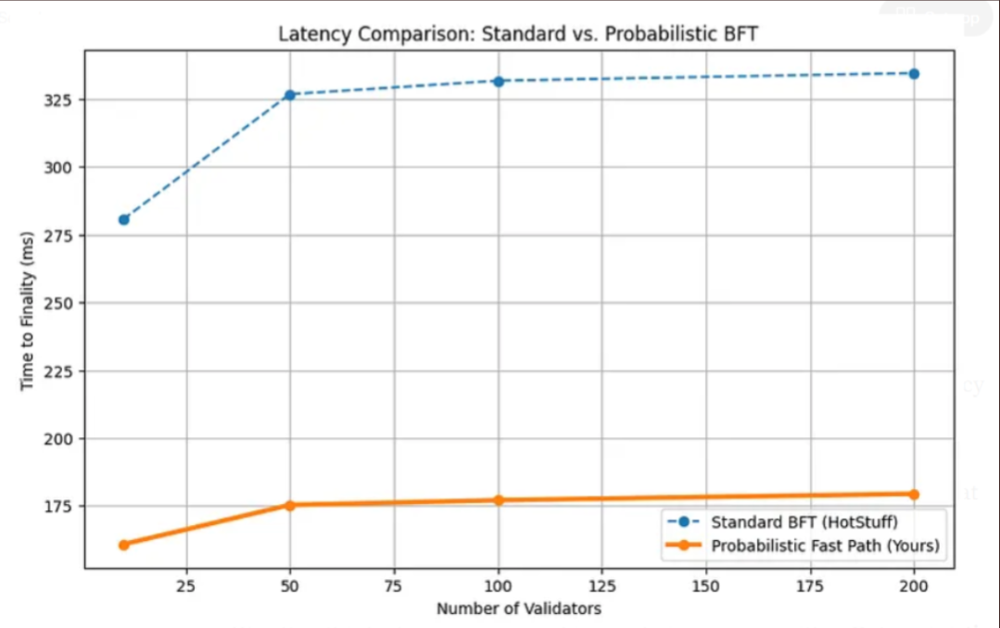
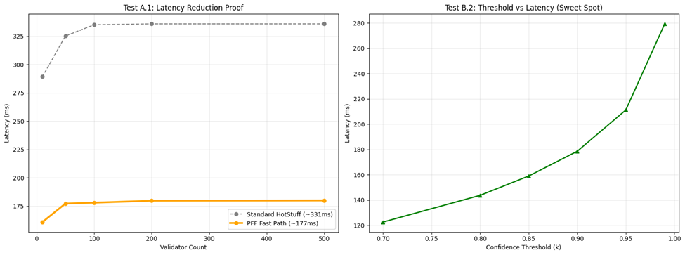
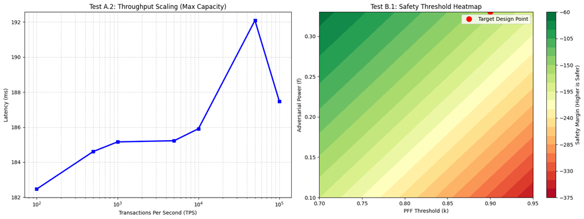
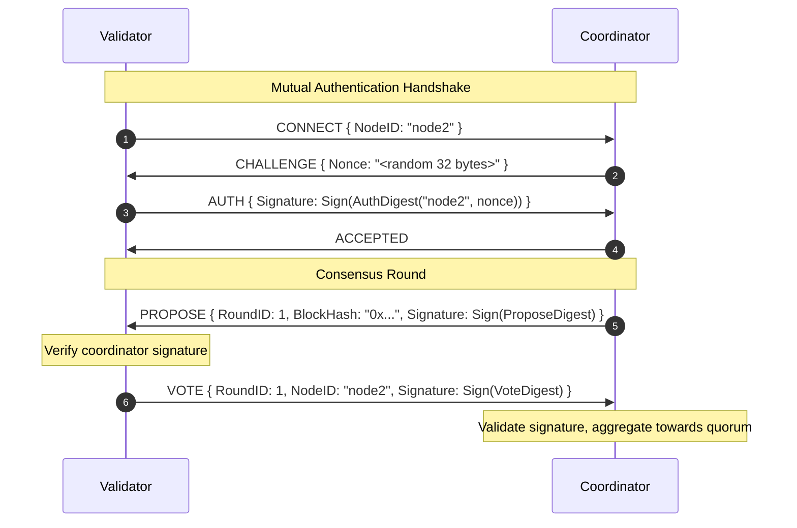

<div align="center">

# ⚡ Probabilistic Fast Finality (PFF)

**A high-performance consensus middleware and research harness exploring optimistic, single-round fast-path finality for BFT consensus networks.**

[](https://golang.org)
[]()
[]()
[]()
[](LICENSE)

> 📖 **Research Publication:** [Probabilistic Fast Finality: Reducing BFT Latency by Up to 46% in the Common Case](https://medium.com/@abdullahiabbaahmad39/probabilistic-fast-finality-reducing-bft-latency-by-up-to-46-in-the-common-case-04895ded843a)

</div>

---

## 📌 Executive Summary

Traditional Byzantine Fault Tolerant (BFT) consensus protocols (e.g., HotStuff, Tendermint, PBFT) require multiple consecutive communication phases (prepare, pre-commit, commit) to finalize state transitions, incurring multi-RTT latency penalties even under synchronous and benign network conditions.

**Probabilistic Fast Finality (PFF)** introduces an optimistic express-lane architecture:
1. **Optimistic Fast Path (`FAST_PFF`):** Broadcasts a signed proposal and aggregates a super-majority threshold ($k \ge 0.90$) of cryptographic signatures in a single network round-trip.
2. **Pessimistic Fallback (`FALLBACK_BFT`):** If network partitions, severe jitter, or Byzantine delays prevent threshold collection within a strict deadline ($t_{\text{fast}} = 300\text{ ms}$), the coordinator delegates the proposal to the standard multi-round BFT pipeline.

This repository provides the **Go reference implementation and distributed testbed** for PFF, featuring mutual Ed25519 authentication, zero-dependency streaming concurrency, and a real-world test harness to validate simulations against live network conditions.

```
                    Coordinator broadcasts signed proposal
                                      │
                          ┌───────────▼────────────┐
                          │ Collect validator      │
                          │ signatures (≤ 300 ms)  │
                          └───────────┬────────────┘
                                      │
                          ┌───────────▼────────────┐
                          │   ≥ 90% signatures?    │
                          └────┬──────────────┬────┘
                               │ YES          │ NO
                        ┌──────▼──────┐  ┌────▼────────┐
                        │  FAST_PFF   │  │FALLBACK_BFT │
                        │ Express RTT │  │ (BFT path)  │
                        └─────────────┘  └─────────────┘
```

---

## 🔬 Simulation & Modeling Insights (Google Colab)

Prior to building the Go distributed engine, the mathematical model, latency bounds, and threshold parameters for PFF were extensively simulated and evaluated in **Google Colab**.

### Key Findings from Simulated Workloads

| Metric / Scenario | Simulation Result | Theoretical Baseline | Design Takeaway |
|---|---|---|---|
| **Optimistic Fast-Path Latency** | **~177 ms** (simulated WAN RTT) | 3-Phase BFT (~331 ms) | **~46% projected latency reduction** in synchronous conditions |
| **Quorum Threshold ($k$)** | **$k = 0.90$** | Standard BFT ($k = 0.67$) | Optimal balance point before tail-latency escalation |
| **Adversarial Tolerance ($f$)** | Robust for $f \le 0.20$ | Classical $f < 0.33$ | High safety margin on optimistic fast-path execution |

---

### Simulation Figures & Visualizations

<details open>
<summary><b>📈 Click to view simulation plots & threshold analysis</b></summary>

<br>

#### 1. Latency Scaling Comparison (PFF Fast-Path vs. Multi-Round BFT)

*Simulated comparison illustrating how PFF avoids compounding round-trip latency across growing validator sets compared to traditional 3-phase pipelines.*

<br>

#### 2. Threshold Sweet Spot & Cluster Scaling

* **Left:** Simulated latency profile across validator cluster counts.
* **Right:** Quorum threshold ($k$) vs. signature collection latency. Latency scales smoothly between $k=0.70 \rightarrow 0.95$, with steep tail-latency escalation beyond $0.95$, identifying $k=0.90$ as the optimal trade-off between safety margin and latency.

<br>

#### 3. Throughput Scaling & Safety Heatmap

* **Left (Throughput Scaling):** Latency response profile under simulated transaction load up to 50k TPS.
* **Right (Safety Margin Heatmap):** Theoretical safety margin boundaries plotted across adversarial fraction $f$ and threshold parameter $k$, highlighting the target design point ($k=0.90, f \le 0.20$).

</details>

---

## 🏛️ System Architecture (Go Reference Implementation)

To transition from analytical Colab simulations to a real-world system, this repository provides a lightweight, modular consensus middleware written in pure Go standard library (zero external dependencies).

```
pff-sidecar/
├── main.go             # CLI router (keygen | coordinator | validator)
├── coordinator.go      # Quorum aggregation engine, round orchestrator & CSV logger
├── validator.go        # Proposal verification, Ed25519 signer & vote client
├── crypto.go           # Canonical hashing & domain-separated digests
├── network.go          # Length-prefixed framing & atomic wire protocol
├── config.go           # Key management, validation & cluster configuration
├── pff_test.go         # Comprehensive unit & end-to-end integration test suite
├── analyze_results.py  # Scientific visualization & plotting suite (Seaborn/Matplotlib)
├── setup_vps.sh        # Automated VPS node provisioning & firewall setup
└── docs/               # Simulation figures and benchmark visual assets
```

### 🔐 Cryptographic Wire Protocol (`network.go` & `crypto.go`)

Every network interaction is strictly framed with a 4-byte big-endian length prefix (capped at 1 MB) and serialized in JSON:

| Message Type | Direction | Cryptographic Function |
|---|---|---|
| `CONNECT` | Validator $\rightarrow$ Coordinator | Initiates registration with declared node ID |
| `CHALLENGE` | Coordinator $\rightarrow$ Validator | Issues fresh 32-byte cryptographic challenge nonce |
| `AUTH` | Validator $\rightarrow$ Coordinator | Signs nonce with node's Ed25519 private key |
| `ACCEPTED` | Coordinator $\rightarrow$ Validator | Confirms mutual authentication and session establishment |
| `PROPOSE` | Coordinator $\rightarrow$ Validators | Broadcasts proposal hash with coordinator signature |
| `VOTE` | Validators $\rightarrow$ Coordinator | Returns Ed25519 signature over domain-separated vote digest |



---

## 🛡️ Security & Concurrency Design

1. **Strict Private Key Isolation:**
   - Public keys are shared via `cluster_config.json`.
   - Private keys reside strictly in isolated `keys/<node-id>.key` files (`0600` permissions). No node ever possesses the secret key of any peer.
2. **Domain-Separated Digests:**
   - Cryptographic digests utilize explicit tags (`PFF-v1:propose`, `PFF-v1:vote`, `PFF-v1:auth`).
   - Every digest binds the specific `RoundID`, canonical length prefixes, and `NodeID`, preventing cross-round, cross-node, or cross-protocol replay attacks.
3. **Dedicated Single-Reader Concurrency Model:**
   - Each authenticated peer connection is serviced by exactly one long-lived reader goroutine feeding a centralized channel (`inbox chan inbound`).
   - Completely eliminates stream desynchronization, socket frame tearing, and socket buffer pollution from delayed votes.
4. **Invariant-Checked Quorum Calculation:**
   - Quorum size is computed against the *configured* validator set ($\lceil N_{\text{total}} \times \text{PFFThreshold} \rceil$), preventing dynamic quorum-shrinking attacks if nodes disconnect.
5. **Anti-Sybil & Double-Voting Protection:**
   - The coordinator strictly enforces at most one vote per registered validator per consensus round.

---

## 🚀 Quick Start Guide

### Prerequisites
- **Go 1.21+**
- **Python 3.8+** (for visualization scripts)

---

### Option A: Local Cluster Simulation (Single Machine)

You can run a complete multi-validator cluster on your local machine over loopback:

#### 1. Generate Local Cluster Keys & Config
```bash
go run . -mode=keygen -nodes=node1:127.0.0.1:8080:coordinator,node2:127.0.0.1:8081:validator,node3:127.0.0.1:8082:validator,node4:127.0.0.1:8083:validator,node5:127.0.0.1:8084:validator
```

#### 2. Start the Validators (in separate terminal windows)
```bash
go run . -mode=validator -node-id=node2
go run . -mode=validator -node-id=node3
go run . -mode=validator -node-id=node4
go run . -mode=validator -node-id=node5
```

#### 3. Launch the Coordinator
```bash
go run . -mode=coordinator -rounds=100 -suite=A3_Baseline
```

Results are logged in real-time to the terminal and streamed to `results.csv`.

---

### Option B: Distributed Multi-Node VPS Deployment

#### 1. Generate Distributed Keypairs (on a secure master machine)
```bash
go run . -mode=keygen \
  -nodes=node1:<IP1>:8080:coordinator,\
node2:<IP2>:8080:validator,\
node3:<IP3>:8080:validator,\
node4:<IP4>:8080:validator,\
node5:<IP5>:8080:validator
```

#### 2. Deploy Files
- Distribute `cluster_config.json` and the compiled binary to all nodes.
- Distribute **only** `keys/nodeX.key` to its respective machine `nodeX`.

#### 3. Provision & Start Nodes
Run `setup_vps.sh` on each machine to configure firewall rules (`8080/tcp`), then start the validator daemons followed by the coordinator.

---

## 🧪 Testing & Chaos Engineering

### Automated Test Suite
The codebase includes unit and integration tests covering loopback consensus, race-condition detection, and cryptographic integrity:

```bash
# Run full test suite
go test -v ./...

# Run with Go race detector
go test -v -race ./...
```

### Chaos Engineering Test Suites

| Suite Identifier | Label | Experimental Scenario |
|---|---|---|
| **A.3** | `A3_Baseline` | Nominal synchronous network with zero artificial interference. |
| **C.1** | `C1_Jitter` | High-variance network latency simulation ($100\text{ ms} \pm 30\text{ ms}$) via `tc netem`. |
| **C.3** | `C3_Partition` | Simulated network partition via `iptables` drop rules followed by healing. |

### Visualizing Benchmark Results

After running consensus rounds, plot the results using the automated analysis suite:

```bash
pip install -r requirements.txt
python analyze_results.py
```

Generates high-resolution figures in `figures/`:
- `Graph_1_Noise_Impact.png`: Latency distribution comparison across baseline vs jitter environments.
- `Graph_2_Protocol_Resumption.png`: Round-by-round time-to-finality timeline during partition and recovery.

---

## 🗺️ Project Roadmap & Milestones

- [x] **Phase 1: Analytical Modeling & Colab Simulations** *(Completed)*
  - Mathematical formulation of optimistic fast-path threshold.
  - Colab simulations of latency scaling, threshold sweet spot ($k=0.90$), and safety margin bounds.
- [x] **Phase 2: High-Performance Go Networking Engine** *(Completed)*
  - Ed25519 authenticated transport, challenge-response handshake.
  - Domain-separated canonical cryptographic digests.
  - Zero-desync concurrency architecture and CSV streaming metrics.
- [ ] **Phase 3: Live Distributed Testbed Benchmarks** *(In Progress)*
  - Deploy Go nodes across distributed VPS locations (US, Europe, Asia) to validate Colab models over real physical WAN links.
- [ ] **Phase 4: Blockchain State & Chaining**
  - Implement block parent hashing (`ParentHash`) to form continuous stateful chains.
  - Add fork-choice rules and conflict detection.
- [ ] **Phase 5: Native 3-Phase BFT Baseline & Probabilistic Dynamic Estimators**
  - Implement an integrated 3-phase HotStuff baseline (Prepare $\rightarrow$ PreCommit $\rightarrow$ Commit) over the identical network transport.
  - Integrate dynamic evidence threshold formulas ($t_{\text{evidence}}$) and confidence probability functions ($p_{\text{func}}$).

---

## 📜 Citation & Reference

If you use this prototype, methodology, or simulation model in your research, please cite:

```bibtex
@article{ahmad2024pff,
  title   = {Probabilistic Fast Finality: Reducing BFT Latency by Up to 46\% in the Common Case},
  author  = {Ahmad, Abdullahi Abba},
  journal = {Medium},
  year    = {2024},
  url     = {https://medium.com/@abdullahiabbaahmad39/probabilistic-fast-finality-reducing-bft-latency-by-up-to-46-in-the-common-case-04895ded843a}
}
```

---

<div align="center">

Developed with ⚡ by **[@abdoulaahmad](https://github.com/abdoulaahmad)**

</div>
